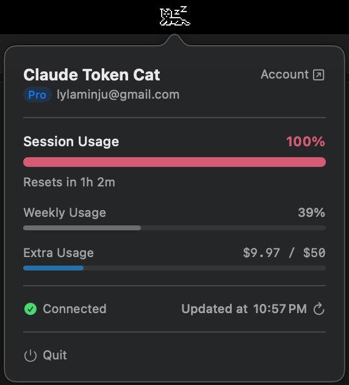

# Claude Token Cat

A macOS menu bar app that tracks your Claude Pro/Max session usage with an animated pixel art cat. The cat's behavior changes based on your 5-hour utilization window.



## Cat States

The cat animates in the menu bar based on your session usage:

```
  Usage         State       Animation
 ──────────────────────────────────────────
  No session    idle        Sitting, tail wag
  0 – 39%       jumping     Energetic jump cycle
  40 – 79%      walking     Calm stroll
  80 – 99%      tired       Lying down, yawning
  100%          sleeping    Lying down, zZZ...
```

## Getting Started

### Prerequisites

- **macOS 13+** (Ventura or later)
- Xcode command-line tools:
  ```bash
  xcode-select --install
  ```
- [Claude Code CLI](https://www.npmjs.com/package/@anthropic-ai/claude-code) (for live usage data):
  ```bash
  npm install -g @anthropic-ai/claude-code
  claude login
  ```

### Build & Run

```bash
./build.sh                         # Build with Swift Package Manager
open build/ClaudeTokenCat.app      # Launch the menu bar app
pkill -f ClaudeTokenCat            # Stop the app
```

If you haven't run `claude login`, the app falls back to mock data with a debug "Cycle State" button so you can preview all cat animations.

## Project Structure

```
ClaudeTokenCat/
│
├── Package.swift                          # Swift Package Manager config
├── build.sh                               # Build script → outputs .app bundle
│
├── ClaudeTokenCat/                        # App source & resources
│   ├── Info.plist                         # App metadata (LSUIElement = true → no dock icon)
│   ├── ClaudeTokenCat.entitlements        # Network client + Keychain access
│   ├── Assets.xcassets/                   # Asset catalog (app icon)
│   │
│   └── Sources/
│       ├── ClaudeTokenCatApp.swift        # @main entry point — launches NSApplication
│       ├── AppDelegate.swift              # Status bar item, popover, animation loop
│       ├── TokenUsageManager.swift        # Usage tracking state + API polling
│       ├── UsageAPIClient.swift           # HTTP client for the usage endpoint
│       ├── ClaudeCodeCredentials.swift    # Reads OAuth token from Keychain / credentials file
│       ├── PopoverView.swift              # SwiftUI popover UI (usage bar, settings)
│       └── CatSpriteRenderer.swift        # Pixel art sprite engine + CatState enum
│
├── build/                                 # Build output
│   └── ClaudeTokenCat.app/                # Assembled macOS .app bundle
│
└── ClaudeTokenCat.xcodeproj/              # Xcode project (optional, can use SPM)
```

## Architecture

```
┌─────────────────────────────────────────────────────────────┐
│                      macOS Menu Bar                         │
│  ┌──────────────────────────────────────────────────────┐   │
│  │  Menu bar icon  ←──  animated image (pixel cat)      │   │
│  └────────────┬─────────────────────────────────────────┘   │
│               │ click                                       │
│  ┌────────────▼─────────────────────────────────────────┐   │
│  │  Floating panel  →  PopoverView (SwiftUI)            │   │
│  │  ┌───────────────────────────────────────────────┐   │   │
│  │  │  Session % bar  ·  Reset timer  ·  Weekly %   │   │   │
│  │  │  Subscription badge  ·  Account link          │   │   │
│  │  └───────────────────────────────────────────────┘   │   │
│  └──────────────────────────────────────────────────────┘   │
└─────────────────────────────────────────────────────────────┘

                                                   ClaudeCodeCredentials
                                                   ┌──────────────────────┐
                                                   │ macOS Keychain or    │
                                                   │ ~/.claude/.creds     │
                                                   │ → OAuth access token │
                                                   └──────────┬───────────┘
                                                              │
┌─────────────────────┐       publishes         ┌─────────────▼────────────┐
│  TokenUsageManager  │ ────────────────────▶   │     AppDelegate          │
│  (ObservableObject) │   @Published state      │                          │
│                     │                         │  observes changes →      │
│  · usagePercent     │                         │  switches CatState →     │
│  · weeklyUsagePercent   ◀──── Combine ────    │  restarts animation      │
│  · sessionResetDate │                         │                          │
│  · isSessionActive  │                         └──────────┬───────────────┘
│  · catState         │                                    │
│  · usageRatio       │                                    │ frames(for:)
└────────┬────────────┘                                    ▼
         │ fetches via              ┌─────────────────────────────────────┐
         ▼                          │          CatSpriteRenderer          │
┌─────────────────────┐             │                                     │
│  UsageAPIClient     │             │ 28×18 pixel grids → image           │
│                     │             │ (template for light/dark)           │
│  GET /api/oauth/    │             │                                     │
│      usage          │             │ 5 animated states:                  │
│  GET /api/me        │             │ idle/jumping/walking/tired/sleeping │
└─────────────────────┘             └─────────────────────────────────────┘
```

## API & Usage Data

This app uses the **undocumented** `GET https://api.anthropic.com/api/oauth/usage` endpoint to fetch Claude Pro/Max session usage data (5-hour utilization %, weekly limits, reset times). This is the same internal endpoint that Anthropic's own [Claude Code CLI](https://www.npmjs.com/package/@anthropic-ai/claude-code) uses to power its `/usage` command.

OAuth credentials are read from Claude Code's stored authentication (macOS Keychain or `~/.claude/.credentials.json`). The user must have Claude Code installed and logged in via `claude login`.

> **Caveat:** This endpoint is not part of the public Anthropic API. It is an undocumented, internal API used by Anthropic's Claude Code CLI. It could change or break without notice. There is currently no official public API for querying personal Claude Pro/Max subscription usage quotas.

## References

- [Claude Code CLI (npm)](https://www.npmjs.com/package/@anthropic-ai/claude-code) — the origin of the OAuth usage endpoint (defined in the bundled `cli.js`)
- [Claude Code GitHub - Issue #13334](https://github.com/anthropics/claude-code/issues/13334) — confirms `user:profile` OAuth scope is required for usage data
- [codelynx.dev - Claude Code Usage Limits in Statusline](https://codelynx.dev/posts/claude-code-usage-limits-statusline) — documents how the endpoint was discovered via network interception
- [Anthropic API Rate Limits (official)](https://docs.anthropic.com/en/api/rate-limits) — official rate limit documentation (different from the usage endpoint above)
