# Claude Token Cat

A macOS menu bar app that tracks your Claude Pro/Max session usage with an animated pixel art cat. The cat's behavior changes based on your 5-hour utilization window.

  

## Cat States

The cat animates in the menu bar based on your session usage:

| Usage      | State       | Animation |
| ---------- | ----------- | --------- |
| No session | 🔵 idle     |  |
| 0 – 39%    | 🟢 jumping  |  |
| 40 – 79%   | 🟡 walking  |  |
| 80 – 99%   | 🟠 tired    |  |
| 100%       | 🔴 sleeping |  |

## Features

- **Animated pixel art cat** in the menu bar - 5 distinct states that reflect your usage level
- **Real-time session tracking** - polls Claude's usage API every 5 minutes for live utilization data
- **Manual refresh** - instant usage update with a single click
- **Popover dashboard** - session %, weekly usage, extra usage credits, subscription tier, and reset countdown
- **Settings panel** - configurable options that persist across launches:
  - **Animation toggle** - pause/resume the cat animation
  - **Menu bar percentage** - show usage % next to the cat icon
  - **Reset time format** - choose relative ("2d 7h"), absolute ("Fri 6:59 PM"), or both
- **Zero-config auth** - automatically reads Claude Code CLI credentials from macOS Keychain
- **Demo mode** - falls back to mock data with a "Cycle State" button when not logged in or permission is denied

## Installation

**Requirements:** macOS 13+ (Ventura or later)

### Prerequisites

For real-time Claude usage tracking, install [Claude Code CLI](https://www.npmjs.com/package/@anthropic-ai/claude-code) and log in:

```bash
npm install -g @anthropic-ai/claude-code
claude login
```

> On first launch, macOS will ask to access your Keychain. Allow it to enable real-time usage tracking.

If no valid credentials are found (e.g. you haven't run `claude login`, or you denied the permission request), the app falls back to mock data with a debug "Cycle State" button so you can preview all cat animations.

### Option 1: Homebrew (recommended)

```bash
brew install --cask lylaminju/tap/claude-token-cat
```

### Option 2: Direct download

1. Download `ClaudeTokenCat.dmg` from [Releases](../../releases) (_Don't open the .dmg until you complete Step 2_)
2. Remove the quarantine attribute (the app is not code-signed yet, so macOS blocks it):
   ```bash
   xattr -d com.apple.quarantine ~/Downloads/ClaudeTokenCat.dmg
   ```
3. Open the .dmg and copy `ClaudeTokenCat.app` to your Applications folder
4. Launch the app — it will appear in your menu bar

### Option 3: Build from source

**Additional requirement:** [Xcode](https://apps.apple.com/app/xcode/id497799835) (Xcode Command Line Tools alone aren't sufficient)

```bash
git clone https://github.com/mjuup/ClaudeTokenCat.git
cd ClaudeTokenCat
./build.sh                         # Build with Swift Package Manager
cp -r build/ClaudeTokenCat.app /Applications/  # Copy to Applications
open /Applications/ClaudeTokenCat.app
```


## Project Structure

```
ClaudeTokenCat/
│
├── Package.swift                          # Swift Package Manager config
├── build.sh                               # Build script → outputs .app bundle
│
├── ClaudeTokenCat/                        # App source & resources
│   ├── Info.plist                         # App metadata (LSUIElement = true → no dock icon)
│   ├── ClaudeTokenCat.entitlements        # Network client + Keychain access
│   ├── Assets.xcassets/                   # Asset catalog (app icon)
│   │
│   └── Sources/
│       ├── ClaudeTokenCatApp.swift        # @main entry point - launches NSApplication
│       ├── AppDelegate.swift              # Status bar item, popover, animation loop
│       ├── TokenUsageManager.swift        # Usage tracking state + API polling
│       ├── UsageAPIClient.swift           # HTTP client for the usage endpoint
│       ├── ClaudeCodeCredentials.swift    # Reads OAuth token from Keychain / credentials file
│       ├── PopoverView.swift              # SwiftUI popover UI (usage bar, settings)
│       └── CatSpriteRenderer.swift        # Pixel art sprite engine + CatState enum
│
├── build/                                 # Build output
│   └── ClaudeTokenCat.app/                # Assembled macOS .app bundle
│
└── ClaudeTokenCat.xcodeproj/              # Xcode project (optional, can use SPM)
```

## Architecture

```mermaid
graph TD
    Creds["<b>[ ClaudeCodeCredentials ]</b><br>macOS Keychain or ~/.claude/.creds<br>→ OAuth access token"]

    Creds --> TokenUsageManager

    TokenUsageManager["<b>[ TokenUsageManager ]</b><br>(ObservableObject)<br>usagePercent · weeklyUsagePercent<br>sessionResetDate · isSessionActive<br>catState · usageRatio"]

    TokenUsageManager -- "@Published state" --> AppDelegate
    AppDelegate -- "Combine subscribe" --> TokenUsageManager

    TokenUsageManager -- "fetches via" --> UsageAPIClient

    TokenUsageManager -- "@ObservedObject" --> PopoverView

    AppDelegate["<b>[ AppDelegate ]</b><br>observes changes →<br>switches CatState →<br>restarts animation"]

    AppDelegate -- "hosts" --> PopoverView
    AppDelegate -- "frames(for:)" --> CatSpriteRenderer

    PopoverView["<b>[ PopoverView ]</b><br>SwiftUI popover UI<br>usage bars · settings panel"]

    UsageAPIClient["<b>[ UsageAPIClient ]</b><br>GET /api/oauth/usage<br>GET /api/oauth/profile"]

    CatSpriteRenderer["<b>[ CatSpriteRenderer ]</b><br>28×18 pixel grids → image<br>with 5 animated states"]
```



## API & Usage Data

This app uses the **undocumented** `GET https://api.anthropic.com/api/oauth/usage` endpoint to fetch Claude Pro/Max session usage data (5-hour utilization %, weekly limits, reset times). This is the same internal endpoint that Anthropic's own [Claude Code CLI](https://www.npmjs.com/package/@anthropic-ai/claude-code) uses to power its `/usage` command.

OAuth credentials are read from Claude Code's stored authentication (macOS Keychain or `~/.claude/.credentials.json`). The user must have Claude Code installed and logged in via `claude login`.

> **Caveat:** This endpoint is not part of the public Anthropic API. It is an undocumented, internal API used by Anthropic's Claude Code CLI. It could change or break without notice. There is currently no official public API for querying personal Claude Pro/Max subscription usage quotas.

## References

- [Claude Code CLI (npm)](https://www.npmjs.com/package/@anthropic-ai/claude-code) — the origin of the OAuth usage endpoint (defined in the bundled `cli.js`)
- [Claude Code GitHub - Issue #13334](https://github.com/anthropics/claude-code/issues/13334) — confirms `user:profile` OAuth scope is required for usage data
- [codelynx.dev - Claude Code Usage Limits in Statusline](https://codelynx.dev/posts/claude-code-usage-limits-statusline) — documents how the endpoint was discovered via network interception
- [Anthropic API Rate Limits (official)](https://docs.anthropic.com/en/api/rate-limits) — official rate limit documentation (different from the usage endpoint above)
- [opencode-anthropic-auth](https://github.com/anomalyco/opencode-anthropic-auth) — open-source Anthropic OAuth implementation (token refresh flow reference)
- [Piskel](https://www.piskelapp.com/) — free online sprite editor used to create the pixel art animations
